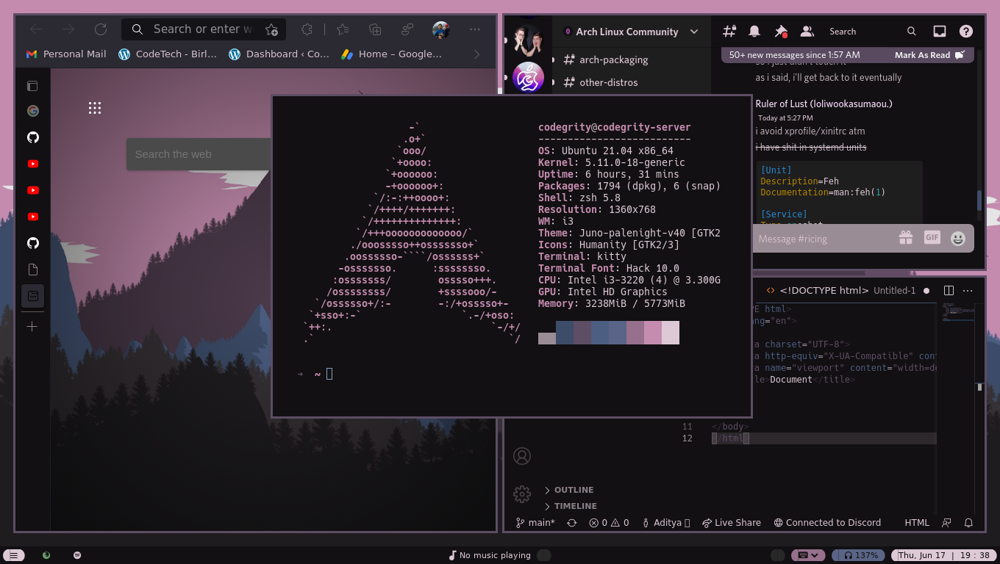
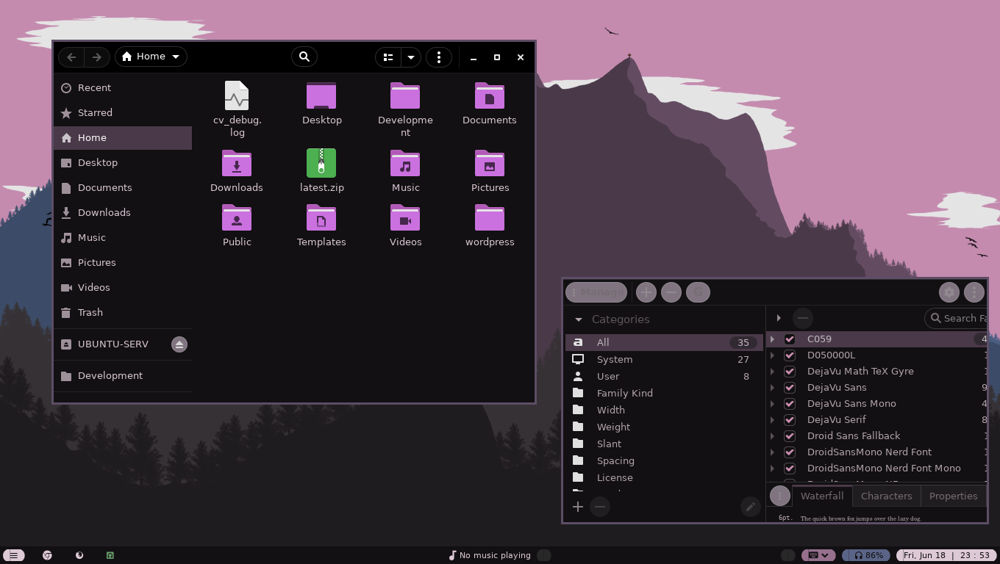
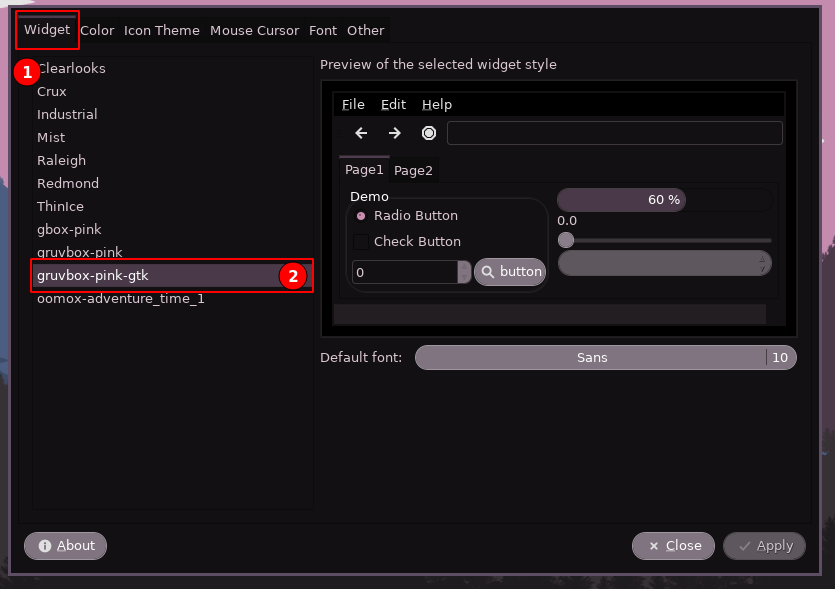
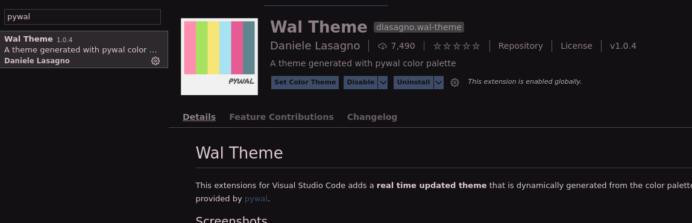
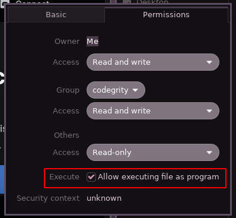

# Gruvbox-Pink-Dots
All of the dot files and configurations for the Pink Gruvbox i3 theme.

Workflow



Custom GTK Theme



## What All I have themed

- i3 [WM]
- Edge Custom Theme [browser]
- Discord [Chat]
- Gruvbox Pink theme Dark [GTK3]
- Custom Terminal Colors [zsh/Kitty]
- Wal: VSCode theme [code editor]

## Installation

Clone this repository
``` 
git clone https://github.com/sortedcord/Gruvbox-Pink-Dots.git 
```

Install pywal -> https://github.com/dylanaraps/pywal

Copy the configurations to your `.config` directory present in the home dir.
```
cp -r .config/* ~/.config/
```

### Applying the GTK theme and icons

Copy the `gruvbox-pink-gtk` folder to `~/.themes/`. Create this directory if it doesn't already exist.

Then use lxappearance to set the theme
```
sudo apt install lxappearance -y
```



### VS Code Theme

To use the vscode theme as shown in the screenshot, first set your wallpaper to `wall.jpg`
```
# install feh
yay -S feh
sudo apt install feh -y

feh --bg-set /path/to/wall.jpg
```

And then run `pywal -i /path/to/wall.jpg`

Install this VSCode plugin-



Reopen VSCode and then it should automatically pick up on the generated theme.

### Install Chrome theme

Check out this repository to download the chrome theme

https://github.com/sortedcord/chrome-gruvbox

### Install Discord theme

First install BetterDiscord from here - https://betterdiscord.app/
Make sure to set as executable before running it. You can do so like this if you use nautilus.



Once you have it installed, open the betterdiscord themes directory and place `pink-gruvbox.theme.css` in it.

```
cp pink-gruvbox ~/.config/BetterDiscord/blob_storage/themes
```

And you are done I suppose.


## Fonts used

| Font Name                 | Usage         | Download                                                    
|---------------------------|---------------|----------------------------------------------------------------------------------------------|
| Hack                      | Terminal Font | https://github.com/source-foundry/Hack/releases/tag/v3.003                                   |
| Google Sans Display       | Polybar Text  | https://fonts.google.com/specimen/Open+Sans                                                  | 
| FontAwesome               | Polybar Icons | https://fontawesome.com/download                                                             |
| FiraCode Nerd Font        | Polybar Icons | https://github.com/ryanoasis/nerd-fonts/tree/master/patched-fonts/FiraCode#download--install |
| Droid Sans Mono Nerd Font | Polybar Icons | https://github.com/ryanoasis/nerd-fonts/releases/tag/v2.1.0                                  |
